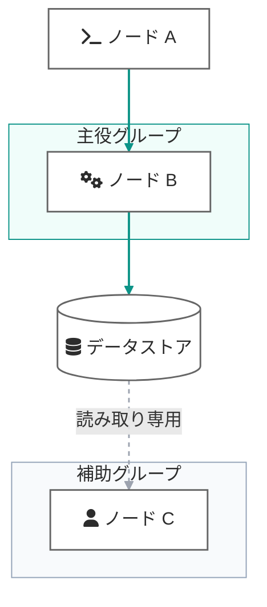
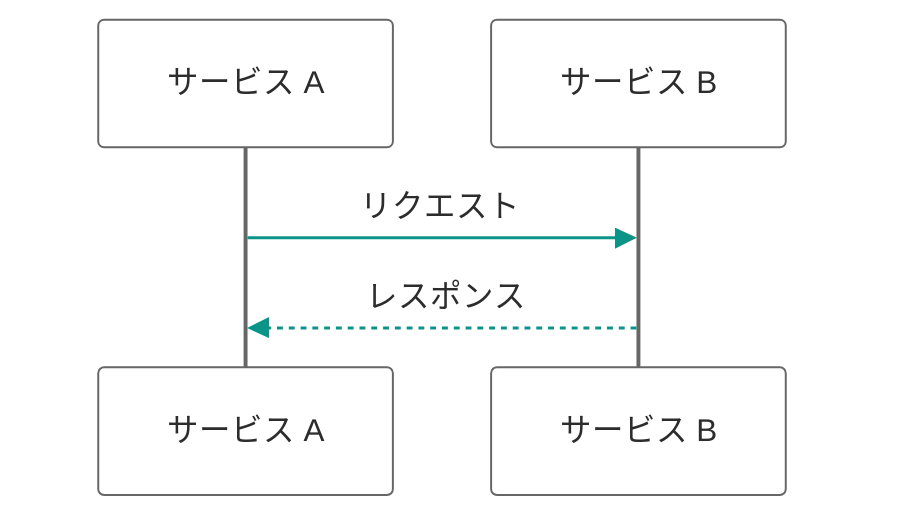
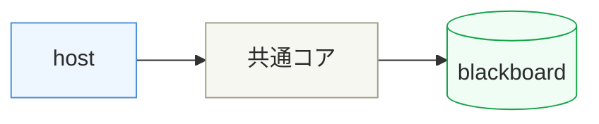

# Mermaid Color Scheme Reference

## Palette

| Role | Value | Notes |
|---|---|---|
| Node fill | `#FFFFFF` | White background — works in both light/dark mode |
| Node stroke | `#666666` (1.5 px) | Mid-grey |
| Text | `#2C2C2C` | Near-black |
| Accent link (solid) | `#0D9488` (2 px) | Teal — normal data/control flow |
| Non-destructive link (dashed) | `#9CA3AF` (1.5 px, `4 4`) | Grey dashed — read-only / monitoring / side-effect-free paths |
| Primary container fill/stroke | `#F0FDFA` / `#0D9488` | Light teal — highlight subgraph |
| Neutral container fill/stroke | `#F8FAFC` / `#94A3B8` | Light grey — auxiliary subgraph |

## flowchart classDef / style / linkStyle

```
classDef node fill:#FFFFFF,stroke:#666666,stroke-width:1.5px,color:#2C2C2C
```

Subgraph styles (applied with `style <id> ...`):

```
style Main fill:#F0FDFA,stroke:#0D9488,color:#2C2C2C
style Sub  fill:#F8FAFC,stroke:#94A3B8,color:#2C2C2C
```

Link styles (indices are declaration-order, 0-based):

```
linkStyle 0,1,2 stroke:#0D9488,stroke-width:2px
linkStyle 3     stroke:#9CA3AF,stroke-width:1.5px,stroke-dasharray:4 4
```

- Solid teal = normal flow
- Dashed grey = read-only / monitoring / non-destructive

## sequenceDiagram init directive

Paste as-is before `sequenceDiagram`:

```
%%{init: {'theme': 'base', 'themeVariables': {'actorBkg': '#FFFFFF', 'actorBorder': '#666666', 'actorTextColor': '#2C2C2C', 'signalColor': '#0D9488', 'signalTextColor': '#2C2C2C', 'noteBkgColor': '#F0FDFA', 'noteBorderColor': '#0D9488', 'noteTextColor': '#2C2C2C', 'activationBkgColor': '#F8FAFC', 'activationBorderColor': '#94A3B8', 'loopTextColor': '#2C2C2C', 'labelBoxBkgColor': '#F0FDFA', 'labelBoxBorderColor': '#0D9488', 'labelTextColor': '#2C2C2C'}}}%%
```

## Palette mapping to sequenceDiagram themeVariables

| Palette role | themeVariable |
|---|---|
| Node fill `#FFFFFF` / stroke `#666666` / text `#2C2C2C` | `actorBkg` / `actorBorder` / `actorTextColor` |
| Accent `#0D9488` | `signalColor` |
| Text `#2C2C2C` | `signalTextColor` |
| Primary container `#F0FDFA` / `#0D9488` | `noteBkgColor` / `noteBorderColor` / `labelBoxBkgColor` / `labelBoxBorderColor` |
| Neutral container `#F8FAFC` / `#94A3B8` | `activationBkgColor` / `activationBorderColor` |
| Text `#2C2C2C` | `noteTextColor` / `loopTextColor` / `labelTextColor` |

## Icon guidelines (fa:fa-*)

- flowchart only — do not use in sequenceDiagram
- Prefix node label: `A["fa:fa-terminal Label"]`
- No emoji / Unicode pictographs — use `fa:` notation exclusively
- Choose names that read well as English fallback on GitHub (fa-terminal, fa-shield-halved, fa-user …).
  GitHub renders neither Font Awesome nor Iconify icons inside Mermaid
  (community discussions #11940 / #146647, unresolved as of 2026-07);
  `fa:fa-*` degrades to its literal label text there — unless the diagram
  is pre-rendered to PNG with this skill's `mermaid2png.py`
- Never use the Mermaid v11 Iconify icon shape (`@{shape: icon, icon: "logos:aws"}`)
  or architecture-diagram icon packs — on GitHub they become a blue "?" box
  with no readable fallback
- A nonexistent icon name is NOT an error — it silently renders blank, and
  rendering verification cannot catch it. Verify unknown names against
  Font Awesome Free Solid (https://fontawesome.com/search?o=r&m=free&s=solid)

### Recommended icons

| Group | Icons | Typical use |
|---|---|---|
| Execution | `fa-terminal` `fa-play` `fa-gears` `fa-code` `fa-rotate` `fa-robot` | Command / run / engine / automation |
| Security | `fa-shield-halved` `fa-ban` `fa-lock` `fa-lock-open` `fa-key` `fa-hand` | Hook / deny / guard / auth / human gate |
| Status | `fa-circle-check` `fa-circle-question` `fa-circle-xmark` `fa-triangle-exclamation` | OK / unknown / fail / warning |
| People | `fa-user` `fa-users` `fa-user-shield` | Approver / team / admin |
| Data/File | `fa-database` `fa-file` `fa-file-lines` `fa-file-pen` `fa-folder` `fa-book` `fa-box` | Store / file / config / docs / artifact |
| Structure | `fa-link` `fa-sitemap` `fa-diagram-project` `fa-network-wired` `fa-server` `fa-cloud` | Link / hierarchy / infra |
| Inspection | `fa-magnifying-glass` `fa-eye` `fa-list-check` `fa-vial` `fa-bug` `fa-gauge` | Analysis / monitor / checklist / test / bug / metric |
| Operations | `fa-scissors` `fa-pen` `fa-wand-magic-sparkles` `fa-download` `fa-upload` | Split / edit / setup / fetch / distribute |
| Time | `fa-clock` `fa-bell` `fa-flag` | Schedule / notification / milestone |

### Blacklist (26 icons — blank in FA6 Free Solid)

`alarm-clock` `aquarius` `aries` `bus-side` `cancer` `capricorn`
`closed-captioning-slash` `gemini` `hexagon` `leo` `libra`
`mobile-vibrate` `non-binary` `octagon` `pentagon` `picture-in-picture`
`pisces` `sagittarius` `scorpio` `septagon` `single-quote-left`
`single-quote-right` `spiral` `taurus` `virgo` `volume`

## Templates (copy-paste)

### flowchart



Apply `class` to the ACTUAL node IDs in the diagram — never leave IDs
copy-pasted from another diagram.

### sequenceDiagram



## Verification

Always render after writing/editing a diagram — this catches syntax errors
and out-of-range `linkStyle` indices (but NOT wrong icon names, see above):

```bash
# all blocks in a file, via the repo helper
python3 scratch/render_mermaid_check.py <file.md> <workdir>
# or render to PNG with this skill
python3 <skill-path>/scripts/mermaid2png.py <file.md>
```

## Override policy

The palette above is the default, not a hard constraint. Override when:

- The user explicitly requests a different color
- Semantic color-coding is needed (e.g. host / core / store / external)

Even when overriding, keep:
- Dashed = non-destructive path (read-only / monitoring)
- Sufficient text-to-background contrast
- ≤ 4–5 colors total

Semantic color-coding example (intentional palette override):


