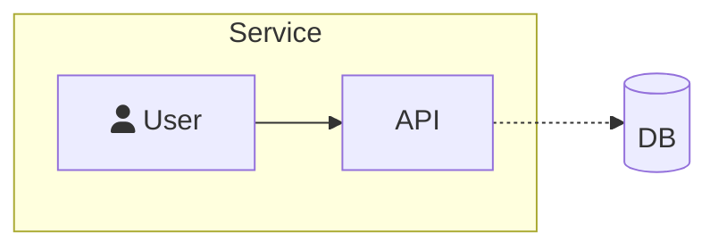
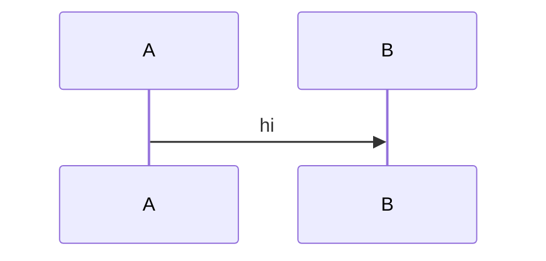

# Doc

Intro with emoji 🚀 before the blocks.


```mermaid
flowchart LR
  subgraph S[Service]
    A["fa:fa-user User"] --> B[API]
  end
  B -.-> C[(DB)]
```

Text between.


```mermaid
sequenceDiagram
  A->>B: hi
```

```js
console.log('not mermaid')
```
